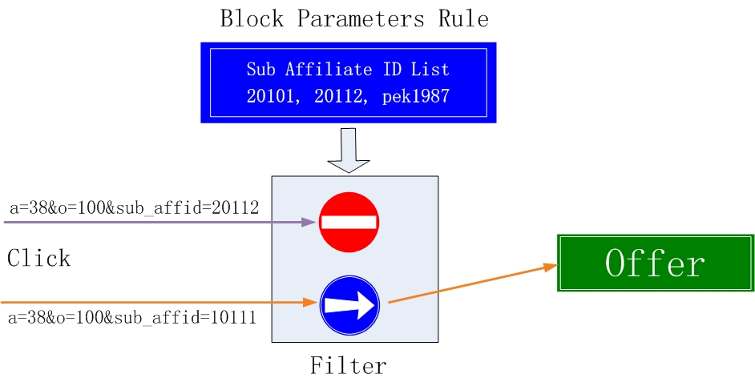

# 参数过滤规则
## 功能
关于渠道对 Offer 的访问控制，可以通过多种方式来设置。
例如为广告主或offer，设置渠道黑名单、白名单，或者利用 Smart Limitation 功能按效果自动控制Campaign状态等。

但实际情况往往是这样的，渠道的某些子渠道流量质量高、另一些子渠道流量质量低， 而广告主都期望流量质量越高越好，这就需要一个比渠道更细粒度的访问控制机制。
Blocked Parameters 功能就是为了这个目的而研发的，该功能可以按照流量的某些参数值，进行过滤屏蔽。

## 设置
系统中可以为不同的 Campaign 或者 Offer， 分别 Blocked Parameters 规则。
可选参数范围：
* 子渠道 Sub Affiliate ID
* Affiliate Sub ID 1（即s1）
* Affiliate Sub ID 2（即s2）
* Affiliate Sub ID 3（即s3）
* Affiliate Sub ID 4（即s4）
* Affiliate Sub ID 5（即s5）

选中参数后，可以指定一个参数值列表。只要流量的参数在列表之内，就会被拒绝。

除了上述指定值的参数，还可以为设置另外一种规则，即如果流量没有携带 Device ID 参数，也会被拒绝。

## 屏蔽子渠道样例
通过分析，发现某渠道的一些子渠道流量转化不好，可以设置选择 Sub Affiliate ID 参数，将这些子渠道ID或名称，添加到列表中。
后续只要这些子渠道的流量，就会被拒绝。

## 广告主系统要求有 Device ID 的样例
如果某个 Offer 要求所有流量必须带有设备ID，我们可以设置一个 Blocked Parameters 规则，设置屏蔽 Device ID 为空的流量即可。

通过上述规则，可以提高到达广告主系统的流量质量。

