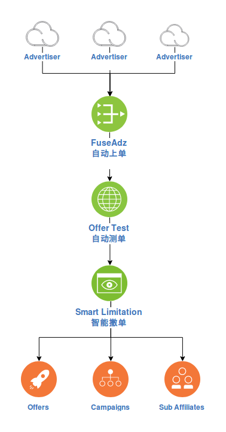

# 上单、测单、撤单那些事， 有人 7x24 帮你办了

谈妥一家上游，接了一批单子，怎么挑选？  
上游单子变了，怎么同步？ 上游单子关了，得关停 Campaigns？  
推广效果要优化，是渠道流量、是子渠道流量？ 还是单子本身？ 鉴别、优化伤不起。

这些都是运营同学们的日常，FuseClick 提供一整套的解决方案，7x24 地帮同学们自动化解这些日常问题。  
使得大家的日常可以放手去解决更大的课题，比如夕阳海滩、清风徐来、咖啡美酒...

## 自动上单
FuseClick 系统套件内包含自动同步Offer的子系统，称作FuseAdz。
这个系统对接了N多的上游系统，点几下鼠标，就可以自动帮你从上游导入Offer、并且定时更新。  
上游系统对接的越来越多，接了FuseClick，就相当于一步完成这N多上游的对接。
>上游单子停了，怎么停这个单子对应的Campaign？
>>自动同步上游状态，系统自动停单子、自动关Campaign。   
>>>有新的上游?
>>>>没关系，我们安排专门的对接同学来帮你完成。

## 自动测单
拉到的Offer太多，怎么选择呢？ FuseClick 内置了 Offer Test 功能，可以自动对 Offer 按照 Targeting 条件进行检测。  
是否能到达app store、经过了几次跳转，看检测结果一目了然。系统可以对自动跳转次数过多的单子，自动下架。
>这个测试怎么对接？ 
>>不用对接，系统内置，全天候可用!

## 智能撤单
系统有 Smart Limitation 功能，对单子、Campaign的数据进行自动智能分析，Offer不好的，停Offer就好了。  
Offer总体数据还可以，但某些渠道数据不好，系统会自动停止这些Campaign。  
进一步，如果渠道数据还可以，但渠道下有些子渠道数据不好，系统仅自动屏蔽这些子渠道的流量就可以了。  
屏蔽的粒度越细，影响域越小，管控越精细，越有利于提供ROI！  

*亲爱的同学，这些都是自动的*
