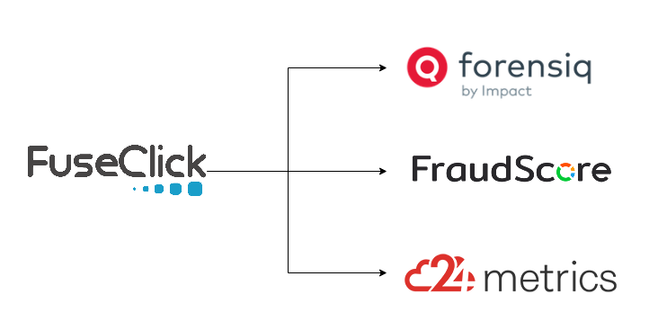

#  对接第三方反作弊服务
随着业务的展开，对接的渠道、广告主越来越多。渠道流量质量参差不齐，广告主的要求也不尽相同。  
FuseClick 内置有 Bot Traffic 过滤、Junk Traffic 过滤、 Unique ID、 CTIT 等措施，可以屏蔽劣质流量、约束转化的唯一性和合理性。   
如果还需要使用第三方作弊检测服务，FuseClick 有 Fraud Detection 功能，已对接了常用的 Fraud Detection Services: Forensiq、FraudScore、24Metrics。
使用FuseClick，即可拥有自动使用这些三方检测服务的能力。

要启用，仅需设置：
1. 第三方服务的Key，该Key从三方平台获取；
2. 送检规则，说明要送检的数据范围，例如某个渠道、某些渠道、全部渠道，某个offer、某些offer、所有offer。

系统在转化发生时，自动将数据推送到指定服务。  
整个过程，运营自己搞定所有事情，无需劳烦任务技术人员。