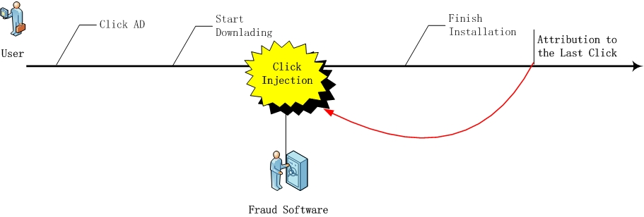

# CTIT Window
CTIT 是 Click-To-Installation-Time 的缩写，表示从点击到APP安装的时间延迟。
根据用户网络状况、和APP安装包大小，需要几秒到数分钟的时间下载。
如果 CTIT 过短、或者过长，则有很大的可能性是作弊。

## 机制
* Click Injection：移动设备上的一些预装软件、或者获得足够权限的应用，可以在后台监听到设备的下载动作。在下载开始、安装完成之前，向后台、归因平台发送伪造点击信息，以获得Last Click归因方式下的效果归因；
* Click Flooding：通过Bots、Device Farms等，大量发送虚假点击；有的软件平台长时间的自动重发Click数据，骗取获取归因效果。

设置 CTIT 时间窗口，仅接受窗口内的 Click 数据，如果 Click 处于窗口之外，则判定该转化无效。 
例如设置窗口为 5s ~ 60s， CTIT 时间小于5s的、大于60s的，都属于无效转化。

## 设置
在 Offer Event 属性页设置 CTIT 窗口：
* 设置窗口开启时间 Min
* 设置窗口关闭时间 Max

设置后即时生效。

