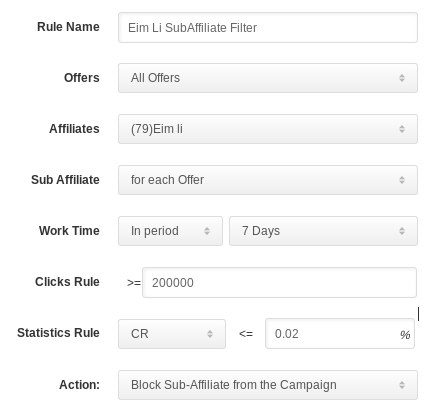

# Smart Limitation
The marketing company’s operations team is responsible for integrating with partners and improving the performance of their campaigns. They need to analyze the data online and take action as quickly as possible to promote ROI.    
FuseClick's Smart Limitation feature exactly meets the requirements of automation for the operation teams, which can analyst the data of offers, campaigns, affiliates and even the sub affiliates, then block those with poor performance automatically, and it also can be used for click CAPs. 

## Choosing Entities
You can set multiple rules in the Smart Limitation feature. Each rule represent a turning strategy for one or many offers and affiliates.  
If there are only offers selected and no affiliates, the rule will apply to all campaigns that belong to these offers. Similarly, only selecting affiliates means the rule will apply to all campaigns of the affiliates.

## Automation for Campaigns Performance Tuning 
Two thresholds can be set in one rule, one is for clicks and the another one is for conversions or CR. In a certain peroid(daily/weekly/two weeks/overall), once the traffic exceeds the click theshold and the conversions(CR) is still less(lower) than the other threshold, then the campaign will be paused.  
Keeping one appropriate threshold for clicks will ensure that the samples is enough to avoid accidentally pausing the campaign.

## Automation for Sub-Affiliates Performance Tuning
For those affiliates who have many sub-affiliates, pausing their campaign means blocking all traffic for all sub-affiliates. However, this is not a profitable way for tuning ROI.   
We need to analyze the performance of each sub-affiliate and then only block those sub-affiliates with poor performance. The operation team only needs to set the rule action to a sub-affiliate, which is "Blocking Sub-Affiliate from the Campaign". The system will do all the analyst and blocking work automatically.

The other feature "Parameter Targeting" in FuseClick can be used to set the whitelist of sub-affiliate, which means only the traffic from the whitelisted sub-affiliates can be accepted.

## Implementation of Click CAP
Besides these CAP features for Budget and Conversions, the Smart Limitation feature can be used for CAP of Clicks. 
If you only set the threshold for click and no threshold for conversions or CR,  then the rule is a Click CAP Rule. The system will limit the number of daily clicks or total clicks for campaigns or sub-affiliates.

The system analyzes performance and takes action according the Smart Limitation rules automatically and continuously. The operations team simply checks the rule action log and changes the rules as needed.
