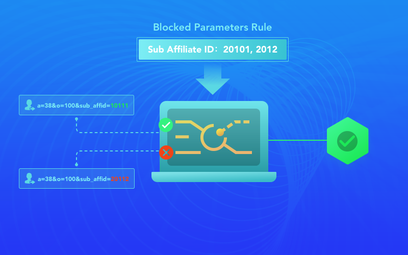

# Parameter Targeting
For affiliate who aggregates multiple traffic sources, the quality of each traffic source varies greatly. If we block affiliate because of some unwanted traffic sources, the other high-quality traffic will be blocked too. So we need access control for traffic sources.

Fortunately FuseClick has Parameter Targeting feature.

You can use a Sub-Affiliate parameter to identify those difference traffic sources from one affiliate. So that you can analyze traffic performance from each Sub-Affiliate in our real-time Analyst Report, and then set up rules in the Parameters Targetting feature to block those Sub-Affiliates with poor performance. 

In addition to the Sub-Affiliate parameters, we can set up rules for other parameters, such as Sub-ID1, Sub-ID2, Sub-ID3, Sub-ID4, and Sub-ID5, which can be used to identify other properties of the traffic, such as age, interest, etc.

Besides, the feature can be used to constrain the traffic without device identification such as IDFA and GAID.

These rules will be taken into effect immediately, if the traffic match with one of these rules, it will be rejected, so we can improve the quality of traffic in our system and the advertiser system.
